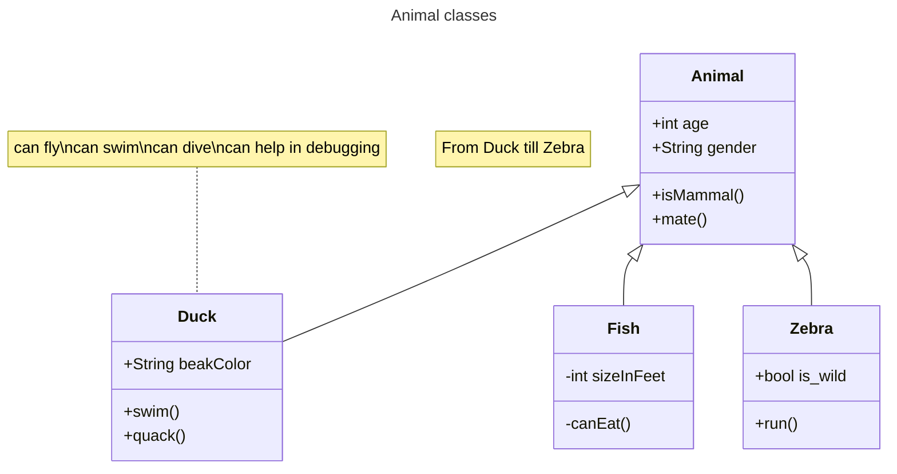

# Week 04-b
2025-10-22 Wednesday

## First Half

* [Review from last time]()

* Academic Statement workshop this Saturday

* [Office Hours tomorrow 6pm PT on Zoom ]()

### Head First Java Chapter 2

Objects, instantiating new objects, inheritance.

* Classes are blueprints for objects
* constructor is a special method named after the class
* `new` keyword allocates space for new object then goes to constructor

### In-Class Activity: Guessing Game

We'll take turns mob/pair programming.

[Let's review the mob programming roles.]()

* Driver: shares screen with their VS Code, or requests remote control to Paul's computer.
* Navigator: reads out source code for Driver to type
* Facilitator (optional, if we have three students): reads out English description for Navigator to make up source code.

The four git file statuses:

* Committed / clean (default)
* Untracked
* Modified, unstaged
* Modified, staged

Remember the `git workflow`:

* `git status`
* `git add <file>`
* `git commit -m`

## Break

## Second Half

### Quiz 04

Ask for one driver, other class members will be navigators to discuss the answers.

Don't write down anything, you'll get a chance to answer the quiz again after class, before 5pm tomorrow.

### Spiral Movement and Using Classes and Objects

So far, we've been putting everything in `RobotPlayer`, which makes it harder to
understand, test, and divide up work.

* Event, Human Value Change, Emotion
* In-game (from point of view of a bot), meta-game (from your point of view as developer, or bot farmer)

We're going to implement a spiral movement strategy suggested by Wren, and learn how to use *marking*
and *sensing*.

#### Spiral Framework

* Primary direction of movement (N, E, S, W)
* Inward from the current primary movement tells us whether we are still following
* Inward-forward from the current primary movement tells us whether we should turn

#### 

