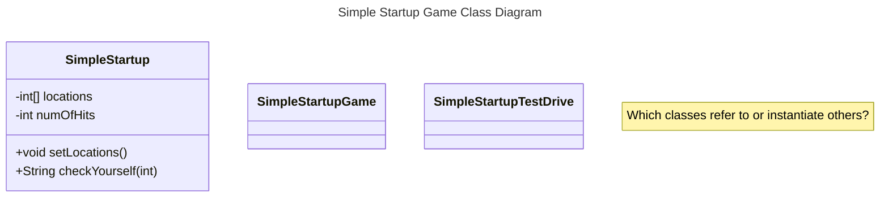

# Week 09a
2025-12-01 

## First Half

Review from before Thanksgiving Break
* Battleship game
* SimpleStartupGame version.
* `SimpleStartup`, `SimpleStartupGame`, `SimpleStartupGameTestDrive`
* Flowchart
* Pseudocode, tests, actual code

### Class Diagrams

Just a taste of class diagrams, for software design and software engineering.

https://mermaid.js.org/syntax/classDiagram.html

### Fixes to Code Last Time

1. Print the string returned from _____
2. Randomize the ____ ____ that gets passed into `setLocations`
3. Fixing the multi-hit bug

## Break

## Second Half

### Design Changes to Prevent Multi-Hit

* Array of booleans
* Other options?

### Changes to Pseudocode

### Changes to Test Code?

### Let's Code Actual Changes

### Strategy for Winning 
